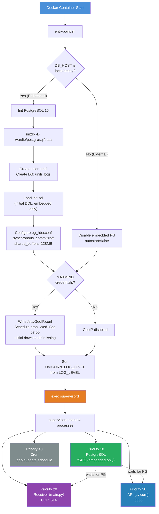
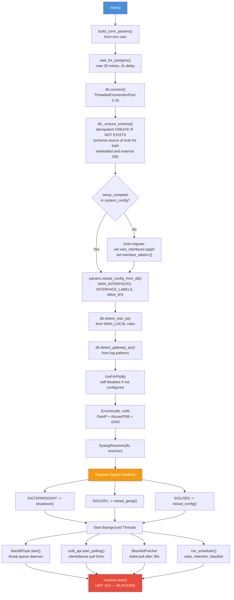
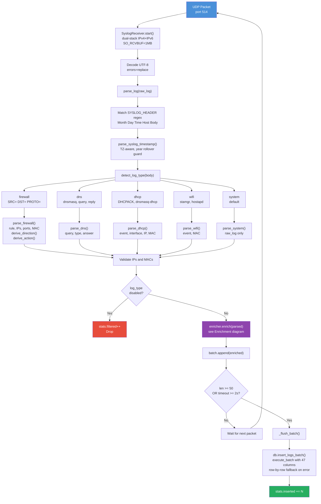
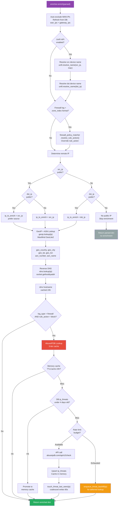
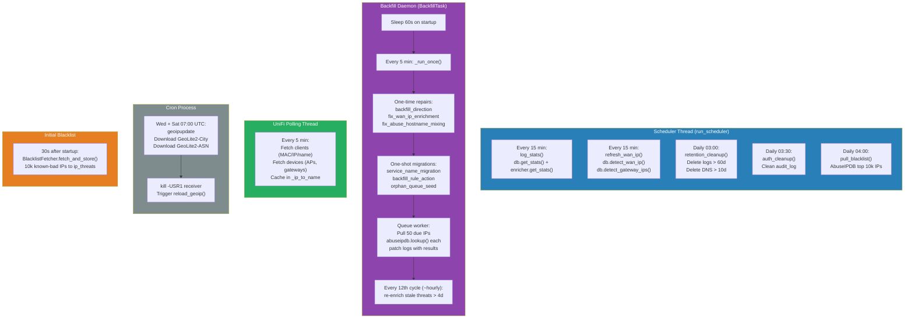
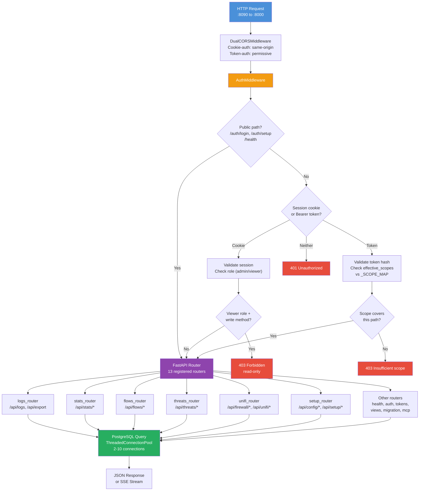
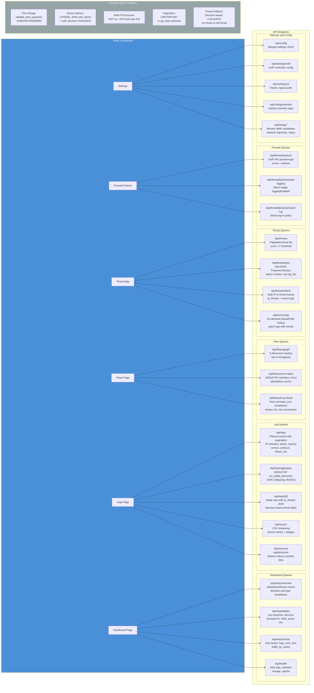

# Insights Plus — Architecture Diagrams

## 1. Container Startup & Process Supervision



## 2. Receiver Startup Sequence



## 3. Syslog Pipeline (UDP to Database)



## 4. Enrichment Decision Tree



## 5. Background Tasks & Scheduling



## 6. API Request Flow



## 7. Frontend Query Patterns



## 8. Receiver Module Layout

The Python backend lives under `receiver/`. Two areas are split into packages;
the rest are flat modules.

```
receiver/
├── db/                         # PostgreSQL layer (was db.py)
│   ├── __init__.py             # public API re-exports (from db import Database, ...)
│   ├── core.py                 # Database class (pool, schema, ~50 methods)
│   ├── connection.py           # build_conn_params, wait_for_postgres, is_external_db
│   ├── config.py               # get_config/set_config, Fernet API-key crypto
│   ├── schema.py               # POST_BOOT_INDEXES / POST_BOOT_DROPS
│   ├── retention.py            # parse_retention_time/days, RetentionTimeConfig
│   ├── logs_sql.py             # INSERT_COLUMNS, INSERT_SQL, count_logs
│   └── exceptions.py           # AdGuardHostMismatch
│
├── unifi/                      # UniFi controller client (was unifi_api.py)
│   ├── __init__.py             # re-exports UniFiAPI, UniFiPermissionError
│   ├── core.py                 # UniFiAPI class (session/auth/classic/integration/firewall)
│   └── exceptions.py           # UniFiPermissionError
├── unifi_api.py                # compat shim: re-exports from unifi/ for legacy imports
│
├── main.py                     # FastAPI + syslog UDP server + background loops
├── api.py                      # HTTP route wiring (delegates to routes/)
├── deps.py                     # FastAPI dependency injection
├── services.py                 # shared service singletons
├── parsers.py                  # syslog line parsers (firewall, DHCP, Wi-Fi, ...)
├── enrichment.py               # GeoIP / ASN / rDNS / threat enrichment pipeline
├── backfill.py                 # historical enrichment + WAN IP backfill jobs
├── query_helpers.py            # SQL helpers for API endpoints
├── firewall_policy_matcher.py  # log-to-policy matching
├── ip_identity.py              # WAN/gateway/local IP classification
├── blacklist.py                # threat IP blocklist helpers
├── adguard_poller.py           # AdGuard Home DNS log poller
├── pihole_api.py               # Pi-hole DNS log poller
└── routes/                     # per-domain FastAPI route modules
```

**Import convention** — modules import from the top level (`from db import ...`,
`from unifi import ...`); the working directory is `receiver/` in the container
(`WORKDIR /app` copies files flat) and under `pytest`. Both `from db import X`
and `from unifi_api import UniFiAPI` still work post-split via package
`__init__.py` re-exports and the `unifi_api.py` shim.
